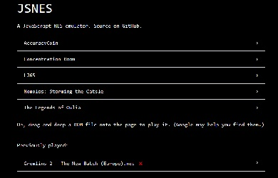
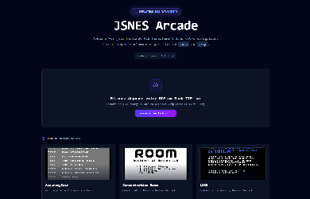
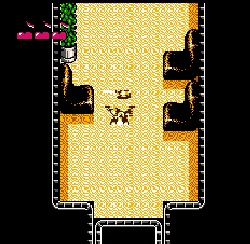
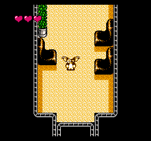
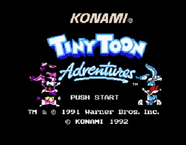
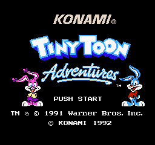
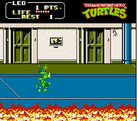
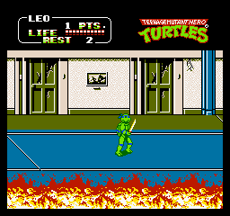

# JSNES (Fork by Cyrhades)

A modern JavaScript NES (Nintendo Entertainment System) emulator library and web interface.

This project is a fork based on the original work by Ben Firshman: [bfirsh/jsnes](https://github.com/bfirsh/jsnes).

---

## Emulation improvements

|                       Index (Original)                       |                         Index (Fork)                          |
| :----------------------------------------------------------: | :-----------------------------------------------------------: |
|          |          |
|                    Gremlins 2 (Original)                     |                       Gremlins 2 (Fork)                       |
|  |  |
|                     Tiny Toon (Original)                     |                       Tiny Toon (Fork)                        |
|  |    |
|                     Turtles 2 (Original)                     |                       Turtles 2 (Fork)                        |
|    |    |

---

## Features and Improvements

This fork introduces significant technical enhancements, new mapper support, audio timing fixes, and a completely redesigned web user interface:

### 1. Hardware Mapper Support

- **iNES Mapper 24 & 26 (Konami VRC6a / VRC6b)**: Full implementation of Konami's VRC6 ASIC mapper with 16KB + 8KB PRG ROM switching, 8 x 1KB CHR ROM switching, customizable mirroring, and scanline/cycle IRQ counters. Enables games such as _Akumajou Densetsu_ (_Castlevania III_ JP), _Akumajou Special: Boku Dracula-kun_ (_Kid Dracula_), _Madara_, and _Esper Dream 2_.
- **iNES Mapper 64 (RAMBO-1)**: Full implementation of Tengen's RAMBO-1 mapper (extension of MMC3 with 1KB CHR mode, PRG mode, extra registers R8, R9, R15, and scanline/CPU cycle IRQ counters). Enables games such as _Klax_, _Skull & Crossbones_, _Shinobi_, _Rolling Thunder_, and _Indiana Jones and the Temple of Doom_.

### 2. Audio Synchronization and Frame Timing Fix

- Fixed an audio buffer underrun bug where extra frame generation was erroneously triggered during active tab execution, causing 2x/3x speedup and stutter.
- Frame timer refactored to accumulate delta time with a maximum catch-up threshold, ensuring smooth 60 FPS playback and crisp audio.

### 3. ZIP Archive ROM Loading

- **In-Memory Decompression**: Uses `fflate` for zero-dependency parsing of `.zip` files.
- Automatically handles both single-ROM and multi-ROM ZIP archives.

### 4. Dynamic Title Screen Preview Generator

- **Headless Execution**: Runs the emulator for ~60 frames (~20ms) to capture a 256x240 ARGB pixel buffer of the game title screen.
- **Smart Monochrome Detection**: Detects black or uniform screens (such as copyright or intro splash screens in games like _Bionic Commando_) and automatically advances up to 300 frames (5 seconds) to capture the actual title screen.
- **Persistent Caching**: Uses a multi-tier RAM and `localStorage` cache for instant preview display.

### 5. Physical Gamepad and Controls Management

- **Live Gamepad Detection**: Queries `navigator.getGamepads()` in real-time with status indicators for connected USB and Bluetooth controllers (Xbox, PlayStation, 8BitDo, generic USB).
- **Hybrid Input Remapping**: Remap buttons using either keyboard keys or physical controller buttons and analog axes.
- **Reset Option**: One-click restoration of default control bindings.

### 6. Modern Web UI

- Dark-mode arcade aesthetic with glassmorphism panels, glow effects, and custom scrollbars.
- **CRT Scanlines Overlay**: Toggle vintage TV scanlines overlay filter.
- **Screenshot Capture**: Download instant 256x240 PNG screenshots during gameplay.
- **ZIP Pack Library**: Multi-ROM ZIP files can be saved to "Ma bibliothèque locale" as ZIP Packs and re-opened at any time.
- **Non-blocking Modal Rendering**: Progressive background thumbnail queue for instant popup opening without UI freezing.

---

## Installation

> git clone https://github.com/Cyrhades/jsnes

> cd jsnes/web

> npm install

> npm run dev

---

## Repository and Fork Metadata

- **Original Project**: [https://github.com/bfirsh/jsnes](https://github.com/bfirsh/jsnes) by Ben Firshman
- **Fork Repository**: [https://github.com/Cyrhades/jsnes](https://github.com/Cyrhades/jsnes)
- **Maintainer**: LECOMTE Cyril (<cyrhades76@gmail.com>)

---

## License

Licensed under the Apache License, Version 2.0. See `LICENSE` for details.
